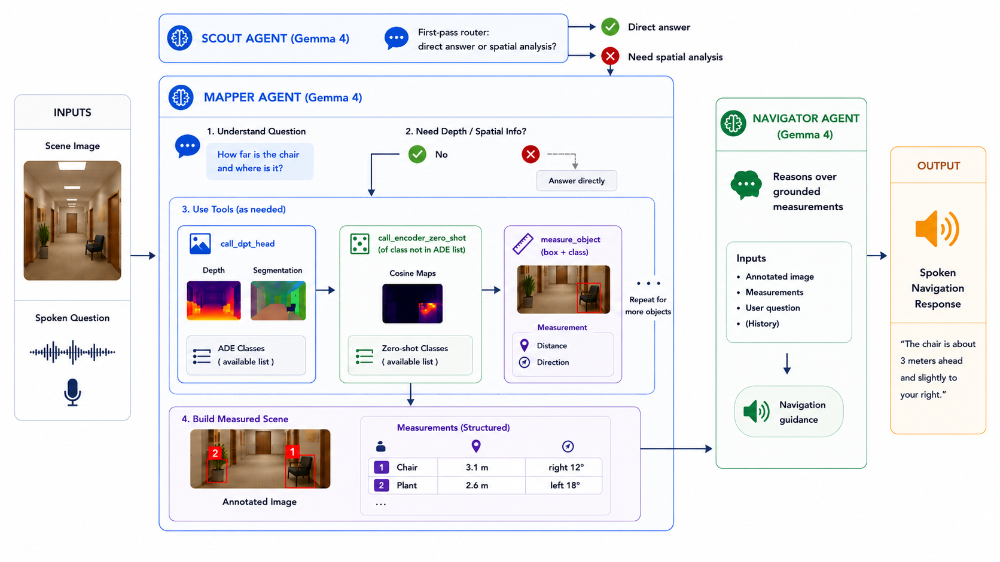
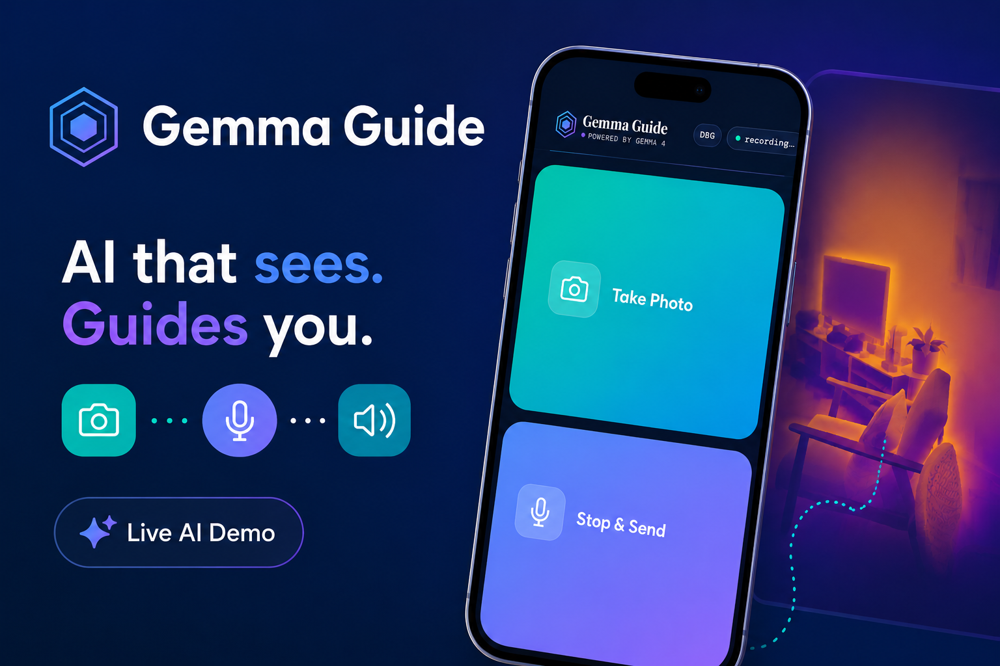
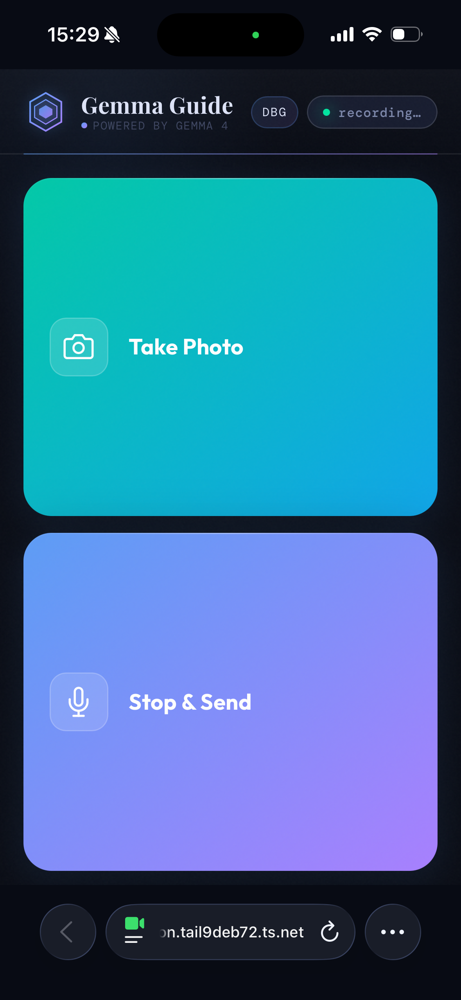
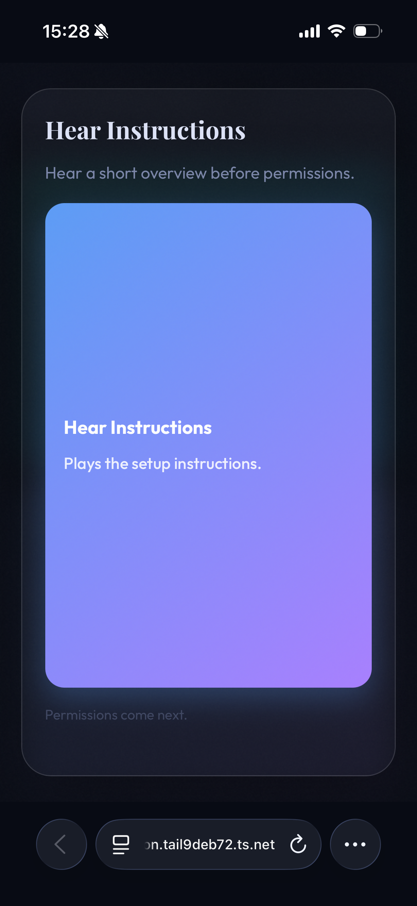
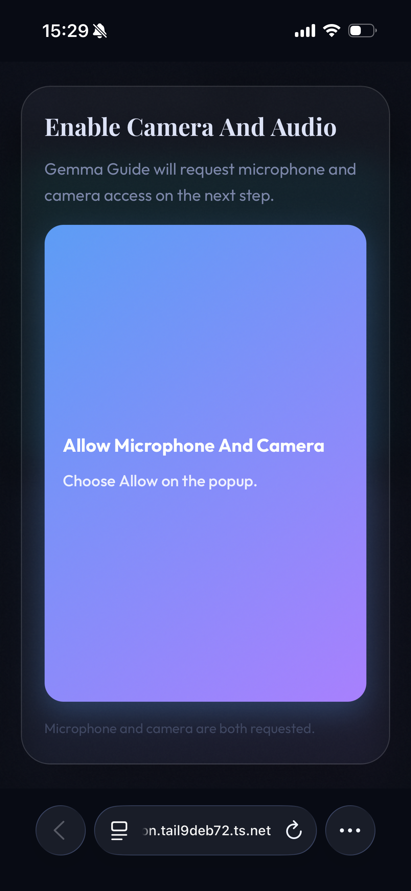
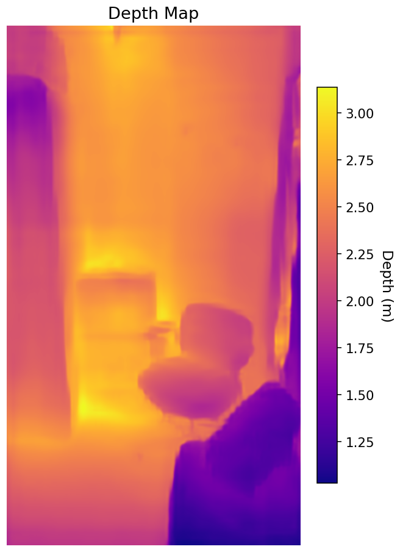
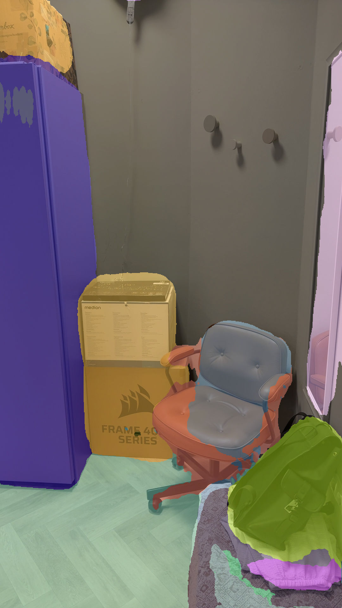
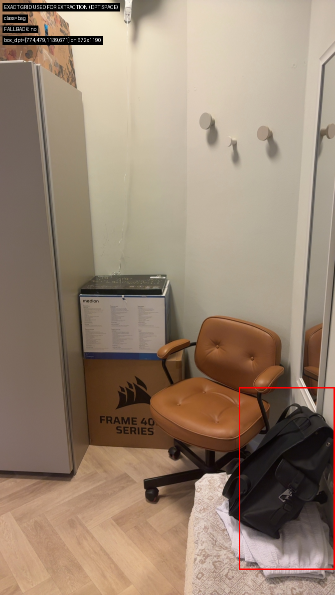
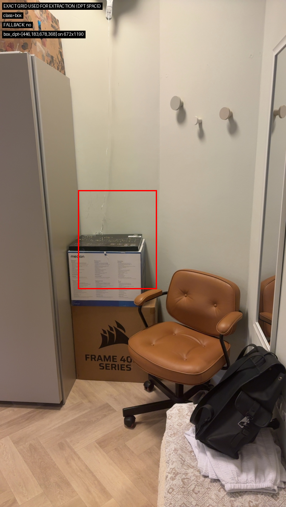
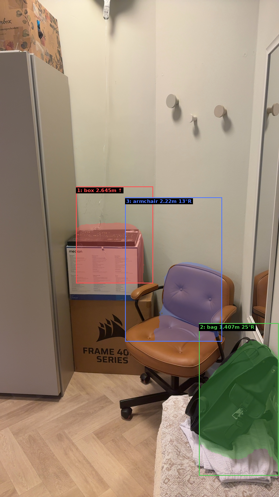

# Gemma Guide 

Gemma Guide is a blind-first multimodal navigation assistant that combines Gemma 4 with TIPSv2 to answer grounded questions like:
- What object is in front of me?
- How far away is it?
- Where is it relative to me?
- How should I move safely?

## Motivation

For a blind user, the important question is not just what is in front of me, but how far away it is and how I should move safely. That is the gap between scene description and real navigation assistance. A useful system must do more than describe a scene in natural language; it must produce grounded spatial answers that guide movement in the real world.

Language models are not reliable depth sensors, but with **Gemma 4**, they can act as an agent that identifies an object, calls specialized spatial tools, and turns grounded distance estimates into practical guidance. **Gemma Guide** is built to turn that idea into reality.

## The Solution

Gemma Guide combines Gemma 4 and TIPSv2 into a grounded navigation system. Rather than a standard chatbot, the solution is designed as a grounded navigator where the user interface hides the complexity of the architecture.

- **The Intelligence (Gemma 4)**: Acts as the multimodal orchestrator. Leveraging native audio-visual understanding, it interprets spoken intent and visual scenes, localizes objects, and decides when to invoke the spatial tool stack.
- **The Grounding (TIPSv2)**: A vision-language encoder with a DPT head that provides dense metric depth and semantic segmentation that traditional LLMs lack.
- **The Interface**: The UI is built around spatial muscle memory, using a simplified two-zone layout and a tap-anywhere shutter. Distinct audio soundscapes and TTS guidance bridge model reasoning with a continuous, accessible user loop.

## Architecture Overview



## Why Gemma 4

Gemma 4 is a strong fit because it combines image understanding, audio understanding, native function calling, and advanced reasoning in a compact model class. That combination matters directly for assistive navigation: the interaction is voice-driven, scenes must be interpreted visually, and the system must decide when conversational answers are enough versus when grounded measurement is required.

Its compactness also matters in practice. Models in this class create a more realistic path toward mobile and edge deployment, reduce dependence on continuous internet access, and improve privacy feasibility for assistive workflows. Capabilities such as pointing and interleaved multimodal interaction map directly to this use case.

## Why TIPSv2

TIPSv2 is a strong fit because it provides the dense spatial perception that a language model lacks on its own. It is a vision-language encoder with text-aligned patch representations and supports the three capabilities this system relies on most:
- Semantic segmentation
- Metric depth estimation
- Grounded zero-shot matching

That combination is essential when navigation depends on measuring specific regions of a scene instead of producing only a global scene description.

## How It Works

Gemma Guide runs as a routed multi-agent pipeline. A lightweight Gemma-based Scout first decides whether a question can be answered directly through general visual understanding, such as scene description or reading, or whether it requires grounded spatial reasoning. If spatial analysis is needed, the request is handed off to the navigation pipeline.

That spatial pipeline begins with a Gemma-based `Mapper`, which receives the user's spoken question and the scene image, determines which objects matter for the request, and localizes those objects in the image. It then calls a TIPSv2-based spatial tool stack to obtain the grounded scene information needed for measurement. On the first pass, the Mapper can also measure several navigation-relevant objects in parallel, allowing the system to build a broader grounded scene state instead of reasoning about a single queried object in isolation.

The key step is object-level measurement. The system does not treat Gemma's localization box as the final answer. Instead, it intersects that region with an appropriate object mask from TIPSv2, which also provides segmentation outputs, so depth is measured only over the most relevant pixels rather than over an entire coarse bounding box or a full-scene depth map. This produces more reliable grounded measurements for individual objects, especially in cluttered scenes. From the selected object region, the system computes both metric distance and horizontal direction, allowing it to answer not only what is present, but where it is relative to the user.

This design also supports open-vocabulary grounding. For objects that map cleanly to the fixed label set, the system uses the TIPSv2 DPT heads to produce semantic segmentation and metric depth. For objects outside that vocabulary, the Mapper can route the request through the TIPSv2 backbone, which produces zero-shot text-aligned similarity maps over candidate class names. The resulting matched region is then passed into the same downstream measurement pipeline for distance and direction estimation.

After measurement, the system packages the grounded scene into an annotated image and a compact structured summary. A third Gemma-based agent, the `Navigator`, receives this cleaned representation and generates the final user-facing guidance. I use this split because the two stages place different demands on the model: the Mapper must manage tool calls and spatial grounding, while the Navigator is more reliable when reasoning over a simplified measured world model rather than raw intermediate tool outputs.

## Challenges

The final architecture was shaped by concrete failure modes:

- **Distance alone was not enough**: navigation also requires direction.
- **Whole-scene depth was too ambiguous**: localization-first measurement worked better.
- **Bounding boxes were too coarse**: masking improved precision.
- **Fixed segmentation vocab was too limited**: zero-shot routing supports broader object queries.
- **Single-agent design was overloaded**: splitting into Scout/Mapper/Navigator improved stability.

## Toward On-Device Deployment

A major next step is on-device deployment. Google AI Edge Gallery is a promising path because it supports on-device Gemma, multimodal interaction, and tool-calling skills, enabling partial on-device execution (Gemma local, TIPS remote).

The current blocker is image-context forwarding into skill execution. Grounded measurement requires Gemma’s localization and the spatial tool stack to reference the exact same image. A standalone mobile app is therefore likely the stronger long-term path, with tighter camera/voice/accessibility control and a clearer route to fully offline use.

## App Showcase



### Main Pane


### Instructions Pane


### Accessibility Pane


## Spatial Grounding by the Mapper Agent

These screenshots show the grounded measurement path, not just chat output:

### Depth Map


### ADE Segmentation Grounding


### Measurement Targets




### Input for Navigator Agent


## Repository Layout

- `app.py`: FastAPI app server entry point.
- `server/`: agent orchestration, endpoints, schemas, and runtime glue.
- `pipeline/`: spatial measurement, TIPS integration, intrinsics, debug rendering, TTS.
- `scripts/serve.py`: one-command startup/shutdown/status for the demo stack.
- `scripts/start_gemma4.py`: vLLM Gemma launch wrapper.
- `notebooks/demo_notebook.ipynb`: end-to-end bootstrap notebook (includes runnable command example).

## How To Run

### Architecture: Two Servers

This project runs as two separate services:
- **Inference server**: `vllm` serving Gemma 4 (OpenAI-compatible API).
- **Application server**: `app.py` (FastAPI) hosting the blind-first UX and multi-agent pipeline.


This runtime is currently configured for a vLLM-style backend, so a running vLLM server is required before the app can answer requests.

### 1. Prerequisites

- Python 3.12
- NVIDIA GPU with CUDA-compatible stack
- Hugging Face access/token for Gemma model download (`HF_TOKEN`) when required

Turing GPU note (for example Tesla T4):
- Turing runtimes may need extra monkey patches and compatibility workarounds to run this stack reliably.
- Use `notebooks/demo_notebook.ipynb` and follow it top-to-bottom; it includes the exact patch flow used for those environments.

Install dependencies:

```bash
pip install -r requirements.txt
```

Optional environment variables (example):

```bash
export HF_TOKEN=your_hf_token
# Needed in some T4/Kaggle-like environments for bitsandbytes compatibility:
export BNB_CUDA_VERSION=129
export VLLM_ATTENTION_BACKEND=TORCH_SDPA
```

### 2. Start the full demo stack

This command starts:
- vLLM (Gemma 4 server)
- FastAPI app
- Cloudflare Quick Tunnel (for HTTPS browser access)

```bash
python scripts/serve.py start \
  --with-tunnel \
  --verbose \
  --app-port 7862 \
  --vllm-port 8000 \
  --model google/gemma-4-E4B-it \
  --vllm-served-name gemma-4-e4b-it \
  --quantization bitsandbytes \
  --max-soft-tokens 560 \
  --max-model-len 8192 \
  --gpu-mem-util 0.75 \
  --max-num-seqs 1 \
  --tensor-parallel 1 \
  --tips-short-side 672
```

This example mirrors the notebook bootstrap flow in `notebooks/demo_notebook.ipynb`.

Why Cloudflare tunnel is included:
- Browser microphone and camera/image upload flows are much more reliable behind HTTPS.
- The tunnel provides a public HTTPS URL so you can use the app from a phone or remote client.

Logs/state are written to `/tmp/gemma_demo_logs/`:
- `vllm.log`
- `app.log`
- `cloudflared.log`
- `demo_state.json`

### 2b. Manual alternative (without orchestrator)

If you prefer to run services yourself, start them in separate terminals:

1. Start vLLM:

```bash
scripts/start_gemma4.sh
```

2. Start the app:

```bash
APP_DISABLE_SSL=1 APP_PORT=7862 python app.py
```

3. If you have cloudflared installed, start a tunnel to the app:

```bash
cloudflared tunnel --url http://127.0.0.1:7862
```

### 3. Check status

```bash
python scripts/serve.py status
```

Look for:
- `urls.app_local` (local app URL)
- `urls.public` (tunnel URL when `--with-tunnel` is enabled)

### 4. Stop services

```bash
python scripts/serve.py stop
```

## Notebook Path

If you want the full guided setup (including environment patching and diagnostics), run:
- `notebooks/demo_notebook.ipynb`

It includes:
- runtime checks,
- serving knobs,
- bootstrap/startup,
- status inspection,
- and cleanup.
